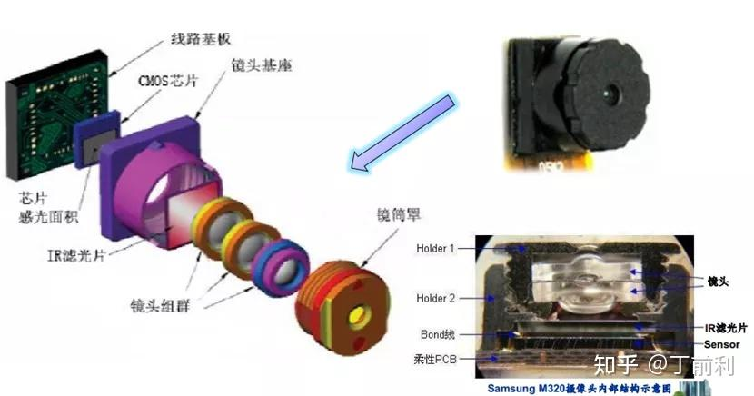
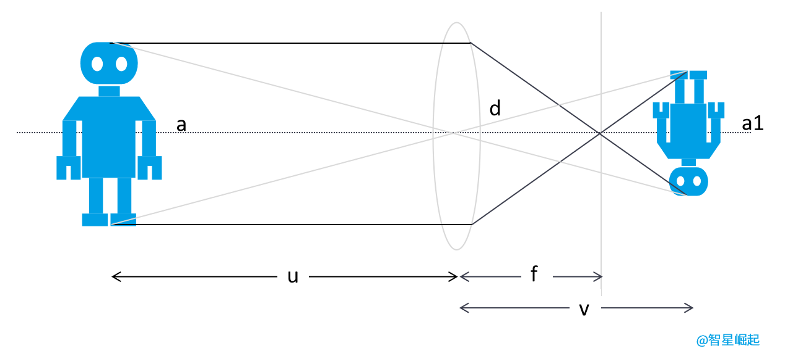
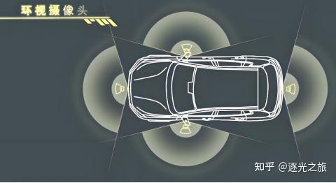
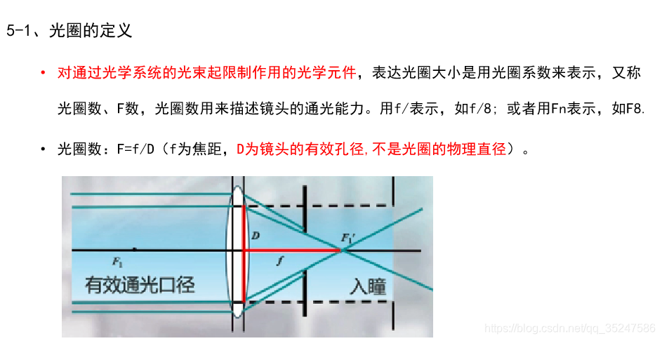

# Overview

摄像头是自动驾驶的重要传感器，其大致构成如下：

大致作用：
* 镜头：聚集光线，把景物投射到成像介质表面，有的是单镜头，有的成像效果要好，需要多层玻璃的镜头。
* 滤色片：人眼看到的景物是可见光波段，而图像传感器可辨识的光波段多大于人眼，因此增加了滤色片将多余的光波段过滤掉，使图像传感器能拍摄多人眼所见到的实际景物。
* 图像COMS传感芯片：即成像介质，将镜头投射到表面的图像（光信号）转换为电信号。
* 线路板基板：将图像传感器的电信号传输到后端，针对车载摄像头这里的线路基板会更多一些电路，需要把并行的摄像头信号转为串行传输，这样抗干扰能力更强一些。

# 参数

对于一个camera，有许多参数来描述

## sensor

传感器主要是将光信号转电信号，再经过A/D转成数字信号。
一个sensor的参数有：
* 类型：现在大部分都是CMOS
* 分辨率
* pixels size：像素的物理大小，例如一个像素3微米
* 色彩矩阵：单个像素只能得到一种颜色的光，因此会有拜尔阵列，例如RGGB
* 帧率

## len

镜头成像原理类似凸透镜的成像原理:

透镜成像原理，凸透镜的中心为光心，光线平行于主光轴（虚线）穿过透镜时，会汇聚到焦点，然后折射成像。其中，机器人a为实物，u为物距；机器人a1为成像，v为相距；f为焦距，表示焦点到光心的距离。

镜头主要用来进行透光，其大致的参数有：
* 焦距：光线焦点到成像平面(sensor)的距离
* 光心：凸透镜的中心
* 视场角(FOV, Field Of View)：
  * 在成像宽度一样的情况下：焦距越大，视场角越小，事业范围越大；焦距越小，视场角越大，视野范围越小
  * 主流摄像头有：远摄FOV<20°；广角摄像头FOV在60~90°；鱼眼摄像头的FOV大于120°
如下是环视摄像头的FOV：

* 光圈：对通过光学系统的光束起限制作用的光学元件，表达光圈大小使用光圈系数来表示的
  * 光圈数：F = f / D，其中f表示焦距，D为镜头的有效孔径
  * 光圈系数越大，D越小，光圈越小；光圈系数越小，D越大，光圈越大
  * 光圈主要是控制曝光量，影响图片的清晰度

* 景深：摄像上把景物空间内能成清晰影像的纵向深度范围称为景深
* IR Cut截止波长：IR=infrared=红外线。它主要用于调整整个系统的色彩还原性. IR-Cut：透过率为50%时的红外光线频率
* 镜头构成：2G4P，表示摄像头由两组镜片组成，每组镜片共有四片镜片

## 协议

MIPI-CSI(Mobile Industry Processor Interface - Camera Serial Interface)：MIPI联盟开发的专用于摄像头的并行传输协议，可以支持1，2，4，8lane数据通道，
这些数据通道可以同时传输数据，但是传输距离大致在30、40厘米范围。物理上是按照排线存在

GMSL：可以长距离高带宽的传输数据，一般通过ser将MIPI-SCI数据序列化成串行数据，传出去