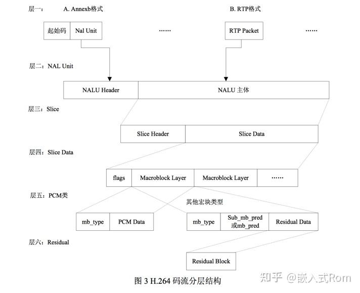
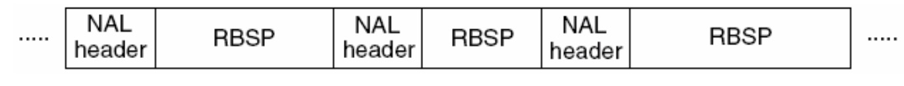
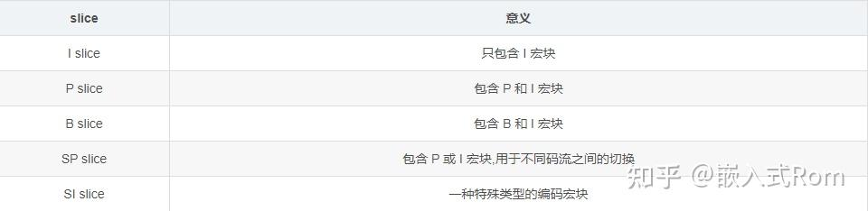
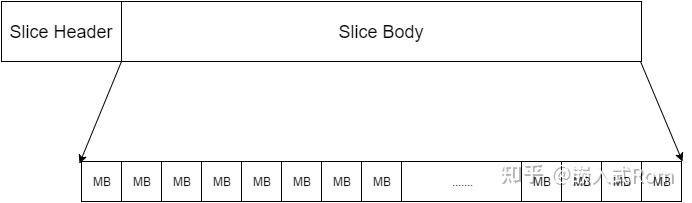
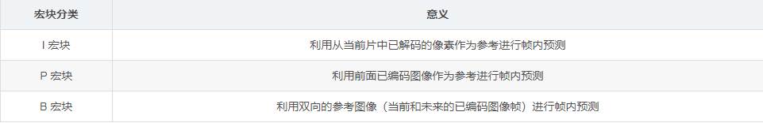
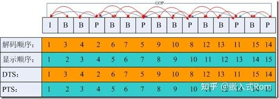
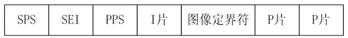
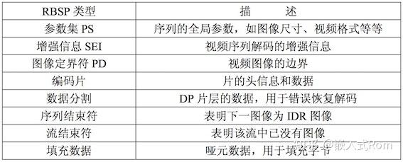

# Overview

主要叙述h264/h265的编解码知识，以及ffmpeg的相关知识

[参考](https://zhuanlan.zhihu.com/p/478741699)

# H264/h265

H.264，又称为MPEG-4第10部分，高级视频编码（英语：MPEG-4 Part 10, Advanced Video Coding，缩写为MPEG-4 AVC）是一种面向块，基于运动补偿的视频编码标准 。

H264 视频格式是经过有损压缩的，但在技术上尽可能做的降低存储体积下获得较好图像质量和低带宽图像快速传输。

整个视频编码的流程如下图所示：


## 相关名词解释

### VCL&NAL

H264 原始码流是由一个接一个 NALU（NAL Unit） 组成，它的功能分为两层：VCL（Video Coding Layer）视频编码层和 NAL（Network Abstraction Layer）网络提取层。
* VCL：Video Coding Layer，主要包括视频压缩引擎和图像分块的语法定义，原始视频在 VCL 层，被编码成视频数据。简单版本的编码过程如下：
  * 将每一帧的图像分块，将块信息添加到码流中；
  * 对单元块进行预测编码，帧内预测生成残差，帧间预测进行运动估计和运动补偿；
  * 对残差进行变换，对变换系数进行量化、扫描。
  * 对量化后的变换系数、运动信息、预测信息等进行熵编码，形成压缩的视频码流输出。
* NAL：Network Abstraction Layer，主要定义数据的封装格式，把 VCL 产生的视频数据封装成一个个 NAL 单元的数据包，适配不同的网络环境并传输。
  * 根据不同应用增加不同的 NAL 片头，以适应不同的网络应用环境，减少码流的传输差错。

一个 NALU = 一组对应于视频编码的 NALU 头部信息 + 一个原始字节序列负荷（RBSP，Raw Byte Sequence Payload）


一个原始的 H.264 NALU(Annex-B格式) 单元常由 [StartCode] [NALU Header] [NALU Payload] 三部分组成，其中 Start Code 用于标示这是一个NALU 单元的开始，必须是 “00 00 00 01”

#### 码流类型

H.264码流分Annex-B和AVCC两种格式。
H.265码流是Annex-B和HVCC格式。

以H.264来说：
* AVCC格式 也叫AVC1格式，MPEG-4格式，字节对齐，因此也叫Byte-Stream Format。用于mp4/flv/mkv, VideoToolbox。
* Annex-B格式 也叫MPEG-2 transport stream format格式（ts格式）, ElementaryStream格式。

区别：
* Annex-B：使用start code分隔NAL(start code为三字节或四字节，0x000001或0x00000001，一般是四字节)；SPS和PPS按流的方式写在头部。
* AVCC：使用NALU长度（固定字节，通常为4字节）分隔NAL；在头部包含extradata(或sequence header)的结构体。

#### NALU类型

H.265的类型包含如下几种：
* VPS
* SPS
* PPS
* SEI
* I帧
* P帧
* ADU：Access Unit Delimiter，可选的NALU，显示标记一个AccessUnit(通常对应一帧或场景内的解码单元)的开始

码流格式如下：
```bash
//  h265 码流最开始永远是 VPS，SPS,PPS，可能含有 SEI，后面接着是I帧P帧数据。
启始码+VPS+启始码+SPS+启始码+PPS+启始码+SEI+启始码+I帧+启始码+P帧+启始码+P帧+.....
```

NAL header的构成(H.265是两个字节长度)：
* 第0位是：0
* 第1~6是：NALU的类型信息。计算公式 NALU = (byte_data & 0x7E) >> 1
* 第7~15是：1

### slice

一个片 = Slice Header + Slice Data

原始视频图像数据保存在 VCL 层级的 NAL Unit 中，这部分数据在码流中被称作是片（slice）

一个 slice 包含一帧图像的部分或全部数据，换言之，一帧视频图像可以编码为一个或若干个 slice。一个 slice 最少包含一个宏块，最多包含整帧图像的数据。在不同的编码实现中，同一帧图像中所构成的 slice 数目不一定相同。

设置片的目的是为了限制误码的扩散和传输，应使编码片相互间是独立的。某片的预测不能以其他片中的宏块为参考图像，这样某一片中的预测误差才不会传播到其他片中。

slice的类型：


slice的组成：


### 宏块(MB，MacroBlock)

宏块是视频信息的主要承载者。一个编码图像通常划分为多个宏块组成.包含着每一个像素的亮度和色度信息。视频解码最主要的工作则是提供高效的方式从码流中获得宏块中像素阵列。

一个宏块由一个 16×16 亮度像素和附加的一个 8×8 Cb 和一个 8×8 Cr 彩色像素块组成。

宏块的类型：


### I/P/B&PTS/DTS

I frame: 自身可以通过视频解压算法解压成一张单独的完整的图片；
P frame：需要参考其前面的一个 I frame 或者 B frame 来生成一张完整的图片；
B frame: 则要参考其前一个 I 或者 P帧 及其后面的一个 P 帧来生成一张完整的图片；
PTS：Presentation Time Stamp，解码后的视频帧什么时候被显示出来
DTS：Decode TIme Stamp，表示内存中的bit流什么时候开始送入解码器进行解码，与PTS可能会不一致，因为B帧会导致重新排序



### GOP(Group Of Picture)

GOP 是画面组，一个 GOP 是一组连续的画面。GOP 一般有两个数字，如 M = 3，N = 12，M 制定 I 帧与 P 帧之间的距离，N 指定两个 I 帧之间的距离。

那么现在的 GOP 结构是:
```bash
I BBP BBP BBP BB I
```

增大图片组能有效的减少编码后的视频体积，但是也会降低视频质量，至于怎么取舍，得看需求了。

### IDR

一个序列的第一帧叫做 IDR帧（Instantaneous Decoding Refresh，立即解码刷新）。

I 帧和 IDR 帧都是使用帧内预测，本质上是同一个东西，在解码和编码中为了方便，将视频序列中第一个 I 帧和其他 I 帧区分开，所以把第一个 I 帧称作 IDR，这样就方便控制编码和解码流程。

H.264 引入 IDR 帧是为了解码的重同步，当解码器解码到 IDR 帧时，立即将参考帧队列清空，将已解码的数据全部输出或抛弃，重新查找参数集，开始一个新的序列。这样，如果前一个序列出现重大错误，在这里可以获得重新同步的机会，IDR 帧之后的帧永远不会使用 IDR 之前的图像的数据来解码。

## RBSP




## 其他

SS：Slice Segment
SPS：sequence parameter set, 序列参数集(解码相关信息，档次级别、分辨率、某档次中编码工具开关标识和涉及的参数、时域可分级信息等)
PPS：picture parameter set, 图像参数集（一幅图像所用的公共参数，一幅图像中所有SS应用同一个PPS,初始图像控制信息，初始化参数、分块信息）
VPS：video parameter set