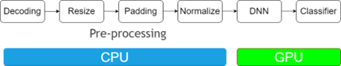

# Overview

主要探讨nvidia中对图像以及视频流相关得支持

# 图像处理

图像分类的 pipeline 大体可以分为 2 个部分：
* 前处理部分:
  *  图片解码：将压缩格式图片(jpeg,h264)还原成原始像素矩阵H * W * C
  *  Resize: 将图片调整未要求尺寸
  *  Padding：填充，如果图片宽高比例和目标尺寸不一致，先缩放后再用黑边或者指定颜色进行填充
  *  Normalize：归一化，将像素值缩放到指定范围。原始提图片像素一般是1~255(uint8)，而神经网络参数初始化和激活函数通常假设输入在较小范围0-1之间
* DNN 部分: 用训练好的神经网络模型（如分类、检测、分割等）对新数据进行预测，GPU 可极大加速这一过程

# NvSIPL

NvSIPL: (NVIDIA Sensor Input Processing Library)nvidia drive/jetson平台得相机接口库，用于摄像头得采集、控制、数据流管理